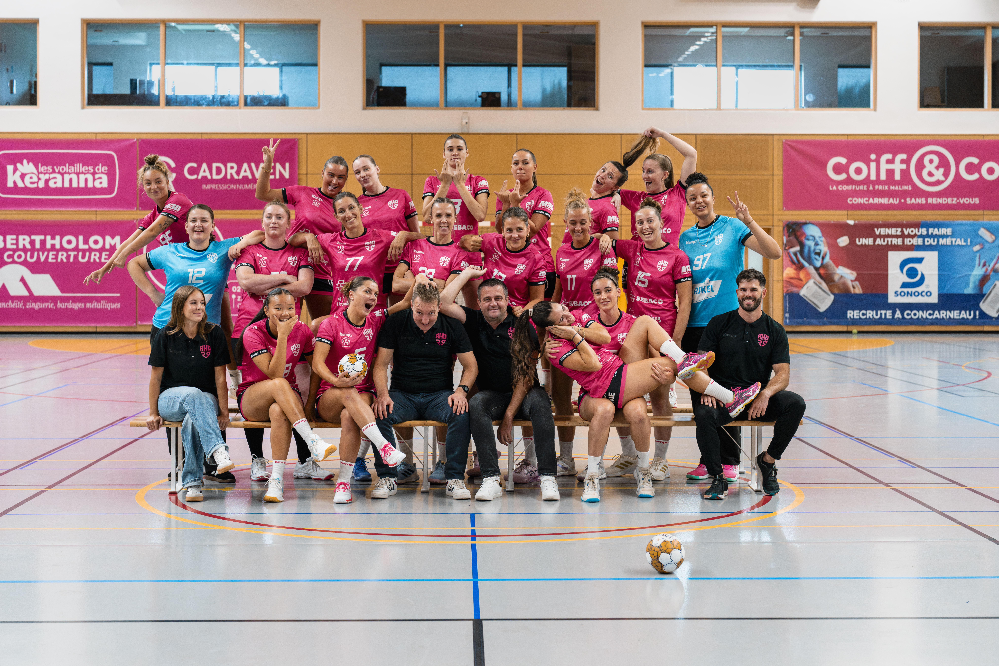

# Series00-Git-jeanne-le-roux-web
Getting the hang of Git seems smoother and easier than Python an encouraging sign for what's to come. The video was also very helpful.

My main goal in learning Python and R is to be able to explore and analyze data without being limited to traditional tools. I want to see how to automate tasks and generate visualizations.
Also, as the explanatory video rightly points out, mastering Git and GitHub is important so I can stop saving files with names like "Final_Project_3_".
Ultimately, I view this learning process as a technical asset that I look forward to leveraging in my future Master's projects.

I learned Git and GitHub are built around repositories and branches, allowing to work on your code without the risk of losing everything.
I realized that minor errors (such as syntax or file paths) are common and that learning often happens through trial and error.
I understood the basic workflow: cloning a repository to your local machine, then using "commit" to save the history of every change made to the application.
I used the "push" command to synchronize my work and upload it to the server for sharing.